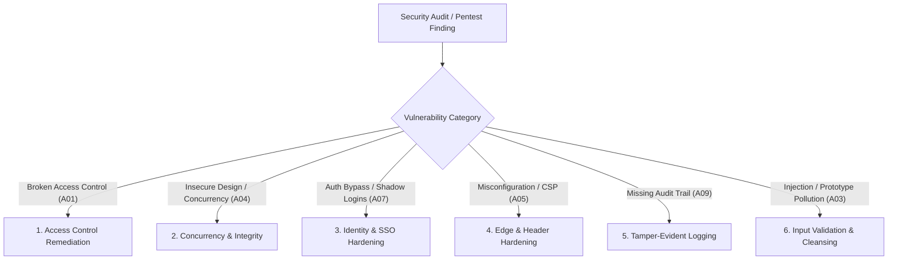

# Application Security & OWASP Remediation Playbook

## Overview

Modern web applications face a continuum of security risks ranging from architectural design flaws (e.g. monolithic state overwrites, missing concurrency guards) to implementation vulnerabilities (e.g. broken object-level authorization, missing security headers, authentication bypasses).

This skill provides an end-to-end engineering playbook for auditing codebases, designing resilient security boundaries, remediating vulnerabilities across the **OWASP Top 10 (2021)** and **OWASP API Security Top 10 (2023)**, and verifying fixes with automated regression tests.

- Deep Technical Standards: [owasp-top-10-master-reference.md](./references/owasp-top-10-master-reference.md)
- Real-World Monolithic State Case Study: [real-world-monolithic-remediation.md](./examples/real-world-monolithic-remediation.md)

---

## Core Security Principles

1. **Never Trust the Client:** Client-side route guards, disabled buttons, and hidden sidebar links are UI affordances, *not* security boundaries. Confidentiality and integrity must be strictly enforced on the server.
2. **Default-Deny Everywhere:** Access to any resource, function, or field must be forbidden unless explicitly allowed by an authorization rule matching the caller's verified identity and tenant/department scope.
3. **Defense-in-Depth:** Combine transport security (TLS/HSTS), edge headers (CSP, X-Frame-Options), application authentication (SSO/MFA), server-side authorization (RBAC/ABAC), and database-level constraints.
4. **Attribution & Tamper-Evident Auditability:** Every write operation and security violation must be recorded in an append-only log capturing the actor, timestamp, action, target, and state diff.
5. **No Destructive Testing on Production:** Penetration tests targeting concurrency, race conditions, or bulk mutations must always target an isolated staging clone with verified point-in-time recovery.

---

## The 6 Core Remediation Workflows



---

### 1. Broken Access Control (A01 / API1 / API5)

#### Symptoms
- API endpoints return full organization datasets (`GET /api/data`, `GET /api/users`), expecting the frontend to filter records by user role.
- Users can view or modify records belonging to other tenants, departments, or users by tampering with request IDs (`/api/items/123` $\to$ `/api/items/124`).
- Monolithic full-document `PUT` endpoints accept whole-state replacement without checking per-record authorization.

#### Remediation Pattern: Server-Side Scoping & Reconciliation
1. **Server-Side Read Filtering (`slimForClient`):**
   ```typescript
   export async function GET(req: Request) {
     const session = await requireActiveSession();
     const viewer = resolveViewerScope(session); // Role, department, tenant

     const storedState = await db.fetchState();
     // Strip out-of-scope records, sensitive executive sections, and unapproved items
     const scopedPayload = filterByViewer(storedState, viewer);
     return NextResponse.json({ data: scopedPayload });
   }
   ```
2. **Write Reconciliation with Default-Deny (`authorizeWorkspaceWrite`):**
   When updating composite or bulk records, reconcile against the stored database copy:
   - *Visible + Missing from incoming:* User had access and omitted it $\to$ Deletion attempt (block if role cannot delete; log violation).
   - *Not Visible + Missing from incoming:* User never received it due to read scoping $\to$ Legitimate omission (silently preserve stored copy).
   - *Not Visible + Present in incoming:* User attempted to inject an out-of-scope record $\to$ Block and log violation.
   - *Locked Sections:* Enforce stored values for sections unprivileged roles cannot alter (e.g. audit registers, approval rules).

---

### 2. Insecure Design, Concurrency & Last-Write-Wins (A04)

#### Symptoms
- Concurrent saves to the same document or entity silently overwrite each other (Last-Write-Wins).
- A malformed or oversized payload can exhaust server memory or corrupt the database.

#### Remediation Pattern: Optimistic Concurrency Control (OCC) & Body Guards
1. **Enforce Version / Watermark Validation:**
   ```typescript
   export async function PUT(req: Request) {
     const session = await requireActiveSession();
     const { data, baseUpdatedAt } = await req.json();

     // Enforce watermark check
     const current = await db.findUnique({ where: { id: RECORD_ID } });
     if (!baseUpdatedAt || current.updatedAt.toISOString() !== baseUpdatedAt) {
       return NextResponse.json(
         { error: "Conflict: document has been modified by another user. Please refresh." },
         { status: 409 }
       );
     }
     // Proceed with atomic save...
   }
   ```
2. **Structural Validation & Payload Limits:**
   - Check `Content-Length` before buffering: reject bodies exceeding `MAX_BODY_BYTES` (e.g. 8 MB) with HTTP 413.
   - Reject prototype pollution keys (`__proto__`, `constructor`, `prototype`).
   - Impose hard array containment caps (e.g. max 5,000 child records) to prevent memory exhaustion.

---

### 3. Authentication & Identity Governance (A07)

#### Symptoms
- Application uses enterprise SSO (Microsoft Entra ID, Okta, Google Workspace), but legacy local password fields (`passwordHash`, `mustChangePassword`, `HEAD_AUDIT_PASSWORD`) remain in the database schema or auth code.
- Dormant local authentication endpoints allow attackers to bypass central MFA and conditional access.

#### Remediation Pattern: SSO-Only Enforcement & Phased Schema Cleanup
1. **Enforce Single Authority:** Remove or disable local password validation routes. Redirect unauthenticated sessions exclusively through OAuth2 / OIDC authorization code flow with PKCE.
2. **3-Step Zero-Downtime Column Removal:**
   - *Step 1 (Code):* Deploy code that stops selecting, inserting, or reading the legacy credential columns.
   - *Step 2 (Verify):* Confirm all running instances are on the new build (prevents ORMs like Prisma from crashing on missing columns).
   - *Step 3 (DDL Migration):* Run non-blocking migration script to drop the columns:
     ```sql
     ALTER TABLE "User" DROP COLUMN "passwordHash", DROP COLUMN "mustChangePassword";
     ```
   - Delete all hardcoded fallback passwords from `.env` and production environments.

---

### 4. Security Misconfiguration & Edge Headers (A05)

#### Symptoms
- Application lacks `X-Frame-Options` or CSP `frame-ancestors`, enabling clickjacking against sensitive approval/sign-off dialogs.
- Absence of Content Security Policy allows injected inline scripts to execute.
- Permissive CORS header (`Access-Control-Allow-Origin: *`) served on private application pages.
- Large binary files (user photos, PDFs) stored as inline base64 data URIs in state responses.

#### Remediation Pattern: Modern Edge Security Headers
1. **Dynamic Nonce-Based CSP (in Proxy/Middleware):**
   ```typescript
   function buildCsp(nonce: string, isDev: boolean): string {
     return [
       "default-src 'self'",
       `script-src 'self' 'nonce-${nonce}' 'strict-dynamic'${isDev ? " 'unsafe-eval'" : ""}`,
       "style-src 'self' 'unsafe-inline'", // Retain unsafe-inline only for dynamic inline style attributes
       "img-src 'self' blob: data:",
       "font-src 'self'",
       "connect-src 'self'",
       "object-src 'none'",
       "base-uri 'self'",
       "form-action 'self'",
       "frame-ancestors 'none'", // Clickjacking defense
       "upgrade-insecure-requests",
     ].join("; ");
   }
   ```
2. **Static Headers (in `next.config.ts` or Web Server):**
   - `X-Frame-Options: DENY`
   - `X-Content-Type-Options: nosniff`
   - `Referrer-Policy: strict-origin-when-cross-origin`
   - `Strict-Transport-Security: max-age=63072000; includeSubDomains` (production only)
   - `Permissions-Policy: accelerometer=(), camera=(), geolocation=(), microphone=()`
3. **CORS Hardening:** Strip unintended wildcard CORS headers (`Access-Control-Allow-Origin: *`) from private application shell responses.
4. **Asset Segregation:** Serve user photos and binary attachments via dedicated cacheable URLs (`/api/users/[id]/photo`) instead of embedding inline base64 blobs into state payloads.

---

### 5. Security Logging & Monitoring (A09)

#### Symptoms
- Audit log links in the UI are non-functional or purely cosmetic.
- Modifications to critical records happen without capturing who made the change or what values were updated.
- Security authorization failures (e.g. unauthorized edit attempts) fail silently without administrative alerting.

#### Remediation Pattern: Append-Only Audit Logging
1. **Dedicated Audit Table:**
   Create an append-only `AuditLog` table with fields:
   `{ id, createdAt, userId, userEmail, userRole, action, entityId, summary, metadata, ipAddress }`.
2. **Log High-Value Events & Blocked Actions:**
   - Log successful governance actions (approvals, closures, sign-offs, role switches, exports).
   - Log security violations (e.g. `security.workspace_write_filtered`, `out_of_scope_write`, `delete_blocked`).
3. **Privileged In-App Viewer:**
   Provide a server-paginated, filterable UI accessible only to administrative / audit leadership roles.

---

### 6. Injection & Prototype Pollution Defense (A03 / A08)

#### Symptoms
- Merging client JSON objects into server state using raw object spread or recursive merge utilities without key sanitization.
- Dynamic SQL queries or database commands built via string concatenation.

#### Remediation Pattern: Safe Deserialization & Object Sanitization
1. **Strip Prototype Pollution Keys:**
   ```typescript
   const FORBIDDEN_KEYS = new Set(["__proto__", "constructor", "prototype"]);

   export function sanitizeObject<T extends Record<string, unknown>>(obj: T): T {
     for (const key of Object.keys(obj)) {
       if (FORBIDDEN_KEYS.has(key)) {
         delete obj[key];
       } else if (typeof obj[key] === "object" && obj[key] !== null) {
         sanitizeObject(obj[key] as Record<string, unknown>);
       }
     }
     return obj;
   }
   ```
2. **Use Parameterized Queries / ORM Builders:**
   Never interpolate raw input into SQL statements. Always use bound parameters (`$1, $2`) or ORM models.

---

## Pre-Pentest Verification Checklist

Run through this checklist before submitting an application for external penetration testing:

| Category | Verification Item | Command / Method | Pass Criteria |
|---|---|---|---|
| **A01 Access Control** | Scoped read permissions | `curl -H "Cookie: ..." /api/data` as low-privilege role | Unauthorized departments, audits, and executive summaries are absent. |
| **A01 Access Control** | Unauthorized write rejection | Crafted `PUT` attempting to edit foreign record | Server reverts changes or returns 403; logs violation. |
| **A04 Concurrency** | Optimistic concurrency conflict | Send `PUT` with stale `baseUpdatedAt` watermark | Server responds with HTTP 409 Conflict. |
| **A04 Resource Caps** | Payload size limits | Send `POST`/`PUT` with body > 8 MB | Server returns HTTP 413 before parsing. |
| **A07 Authentication** | Local login endpoint elimination | Inspect `/api/auth/me` and test legacy auth endpoints | No password fields in payload; local login endpoints return 404/405. |
| **A05 Misconfiguration** | Security headers verification | `curl -I https://app.example.com/` | CSP with nonce present; `XFO: DENY`; `nosniff`; HSTS active; no wildcard ACAO. |
| **A09 Logging** | Audit trail recording | Perform a status change, then query `/api/audit-log` | Mutation is logged with timestamp, user ID, and before/after summary. |
| **A05 Asset Hygiene** | Decoupled asset payloads | Inspect `/api/directory` or `/api/users` response size | Directory size < 10 KB; photos served as cacheable image links. |
